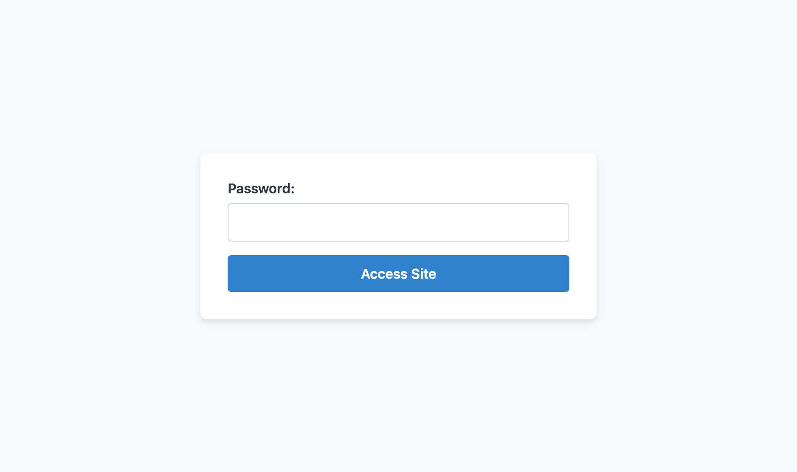

# Site Guard

Protect your site from random visitors with a simple plain-text password guard, configurable in your `.env` file.

Apply the middleware to your service provider of choice, and this package will prevent visiting all routes by default. Instead, a password prompt will be displayed:



It is possible to customize the password page, and to customize which routes are accessible regardless of Site Guard's activation status.

## Installation

You can install the package with `composer`:

```bash
composer require mylonia/site-guard
```

## Usage

### Configuring a password

First, set these environment variables:

```dotenv
SITE_GUARD_PASSWORD=your-passphrase-here
```

### Registering the middleware

You can register the middleware under the conditions of your liking, for example in `AppServiceProvider`:

```php
use Mylonia\SiteGuard\SiteGuardMiddleware;

public function boot(Router $router): void
{
    if (! $this->app->environment('production')) {
        $router->pushMiddlewareToGroup('web', SiteGuardMiddleware::class);
    }
}
```

This ensures that the production website is unaffected, but any potential `local` or `staging` setup will display the message. You can tweak this as desired.

### Publishing assets

You can also exclude particular routes by customising the `config` file.

```bash
php artisan vendor:publish --provider="Mylonia\SiteGuard\SiteGuardServiceProvider"
```

This will publish the custom `views` and the `site-guard` config file. You can further customise the configuration file this way.

For example, you can adapt `excluded_routes` to exclude particular routes. By default, all `site_guard.*` routes are excluded, but you can add more this way. (You can use wildcards.)

You can also customise which middleware is required to run when the Site Guard routes are visited, which may be necessary depending on your project.

## Testing

To run the test suite:

```bash
composer test
```

To run all steps (including linting, static checks, etc.) please run:

```bash
composer verify
```

## Security Vulnerabilities

Please get in touch with [info@mylonia.com](mailto:info@mylonia.com) to report a vulnerability.

## Credits

- [Nico Verbruggen](https://github.com/nicoverbruggen)
- [All Contributors](https://github.com/mylonia/site-guard/contributors)

## License

The MIT License (MIT). Please see [License File](LICENSE.md) for more information.